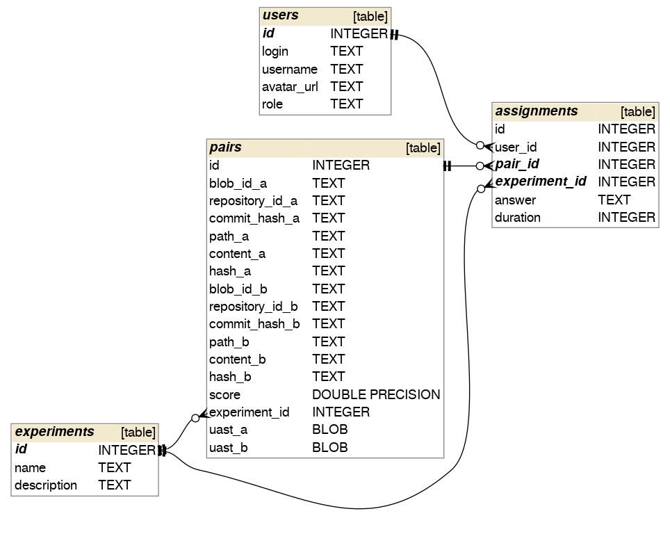

Duplicates 
==========

[Download link (20MB xz-compressed).](https://drive.google.com/file/d/15f-fl0PRSsmooKJdel-qEZ4_FrQE774t)

Duplicates dataset consists of two parts:

1. 1989 labeled pairs of Java files.
2. 633 labeled pairs of Java functions.

Those pairs were labeled by several source{d} employees as "identical", "similar" or "different" in February 2018.
We used [src-d/code-annotation](https://github.com/src-d/code-annotation) web application to perform the labeling.
The goal of making the dataset was tuning for the best hyperparameters in [src-d/apollo](https://github.com/src-d/apollo),
which was the proof-of-concept for [src-d/gemini](https://github.com/src-d/gemini).

Code similarity is quite subjective, and human labelers may contradict each other in some cases.
We've set 3 categories instead of 2 to make the choice easier.

### Format

SQLite 3 database, the schema is shown below.



There are 4 tables:

1. **experiments** - the labeling sessions. There are only two - files and functions.
2. **users** - the people who labeled the pairs of files and functions.
3. **pairs** - the data for each pair, including the code strings and [UASTv1](https://github.com/bblfsh/client-python)-s.
4. **assignments** - the labels per person per experiment.

### Sample code

You need Python 3 with the dependencies installed via `pip3 install -r requirements.txt`.

```python
from duplicates import DuplicatesDataset
ds = DuplicatesDataset("/Users/sourced/Desktop/duplicates.db")
print(ds.experiments)
print(ds.users)
print(len(ds.assignments))
print(len(ds.pairs))
```

